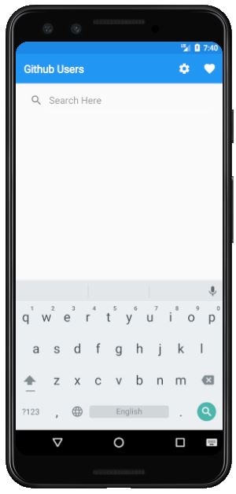
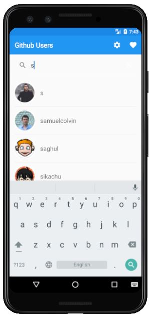
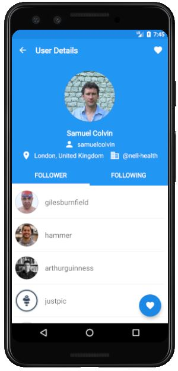
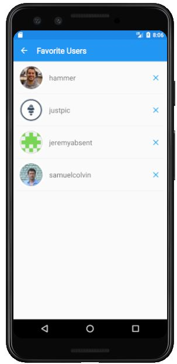
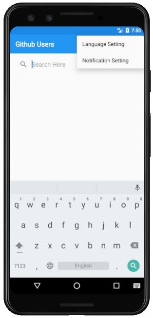
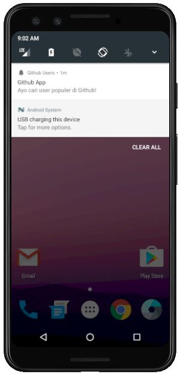

# Github-User-Finder
## About This App
This app was created when I took the Android Application Fundamentals course to implement Intent, Parcelable, RecyclerView, SearchView, TabLayout, Localization, Connection to Web API, JSON Parsing, MVVM, Alarm Manager, Content Provider, Pending Intent, and Data Storage Using SQLite.
This app displays a list of Github user along with their details. The data to be displayed is [GithubAPI](https://docs.github.com/en/free-pro-team@latest/rest) data.

App features:
-	User Searching
-	Users List 
-	User Details
-	Favorite User
-	Reminder Notification

## Preview
To see a preview of this app, you can download the app installer [here](https://drive.google.com/file/d/1FoIYMCe4QtGB5NboyWyqQhX241QXqxNj/view?usp=sharing) and then install it on your Android phone. Or you can watch the preview video [here](https://drive.google.com/file/d/1cVlbeiJ2sOHxDrncbHjrppcXEAmBpSeU/view?usp=sharing).

## Screenshots
|User Searching|User List|User Detail|
|-------------|----------|------------|
|||

|Favorite Users|Setting|Reminder Notification|
|-------------|----------|------------|
|||

## Language
Kotlin

## Architectural Pattern
MVVM (Main - View - ViewModel)

## Additional Libraries
- lifecycle
- recyclerview
- fast android networking
- picasso
- coroutine
